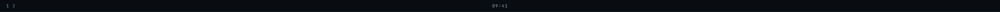
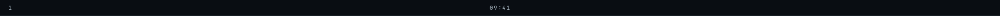
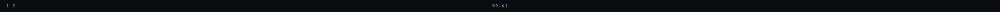
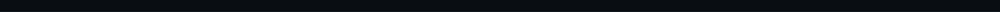
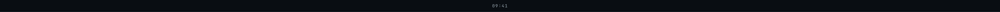
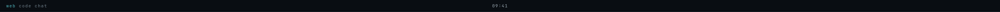
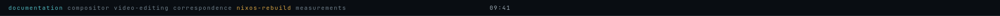
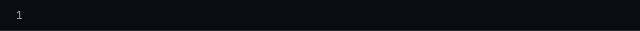

# The top bar, photographed

Generated by `bash ops/ralph/barshots.sh`. Re-run it after any change to
`shell/jv-bar` and commit the diff.

This is the third of these sheets, after `docs/hud/` and `docs/notify/`, and
the shell it photographs is the one that is **always there** (PLAN D13). The
HUD is unmapped until a real frame earns it; the notification corner is
unmapped until some program sends something. The bar is up from the moment the
session starts until it ends, on every monitor, 31 px tall — which means every
decision in it is a decision about a *glance*, and a glance is the one thing no
headless test can take.

Until this sheet existed, `shell.qml`, `Workspaces.qml` and `Clock.qml` were
reached by **no QML gate at all**: `nix build .#jv-bar` ran qmllint over them,
and `tools/tests/test_dependents.py` wrote the gap down so it would not become
invisible. Two of this surface's questions are answered by nothing else in the
repository, and both are properties of a laid-out surface at a real width:

- **Does the workspaces row stay out of the corner the HUD draws in?**
  `shell.qml` reserves `300 + inset` px at the right end and promises in prose
  that "nothing may be laid out inside it" — to a process on another layer that
  draws there regardless and cannot be asked. Every shot asserts the row's
  reach into that corner is **0 px**.
- **Is the clock on screen at all?** It is centred on the *screen*, not on the
  space left over, and hides itself rather than be drawn underneath another
  process's plates. Whether it fits depends entirely on how wide the monitor
  is, so it can only be asked at a real width.

## What you are looking at

Each PNG is **one whole bar, at the width of a real monitor**: 2560 px for
ares' primary (HP 27xq at 2560x1440), 1920 px for either side monitor (DP-1 and
DP-2 at 1920x1080), and one deliberately narrow 640 px output that ares does
not have. The height is not a number anyone chose — it is
`Theme.labelPx + Theme.padPx * 2`, derived here exactly as `shell.qml` derives
it, which is 31 px at the current type scale.

The paper is the bar's own ground (`ground_deep`), unlike the other two sheets,
whose neutral grey is the harness's: this surface is opaque, reserves its own
strip, and has nothing behind it. What you see is what the compositor maps.

**Recorded and composed.** Six of the nine shots are ares' own desk —
`harness/fixtures/niri/ares-desk.jsonl` line 1, the real opening snapshot of
`niri msg --json event-stream`, byte for byte, fed through the real
`core/NiriModel.qml`. Two are **composed**: `07-named.png` and
`08-crowded.png` need a desk this machine does not have (workspaces with
names), and they are built in the recording's own shape, every field checked
against it by `tools/tests/test_barshots.py`. The two deltas in `03` and `04`
are composed too, for the reason `harness/fixtures/niri/README.md` gives: niri
sends them only when a desk someone is sitting at is rearranged.

**The clock reads 09:41 on every shot that knows the time.** Fixed, so that two
runs of an unchanged bar produce the same bytes and the sheet can be compared
against the one committed at HEAD.

## What the colours mean

The whole vocabulary of this surface is a few characters in one of four
colours, which is why every shot carries a caption the row itself produces
(`Workspaces.drew`: `<label>:<reading>`, asserted per shot).

| reading | token | what it means |
|---|---|---|
| `focused` | `teal` | your keyboard is on this workspace — "teal is your own state" |
| `active` | `text_2` | it is on screen on some *other* monitor |
| `idle` | `text_3` | it exists and you are not looking at it |
| `urgent` | `warn` | a window on it is asking for you |

Not the ember, ever. Ember means Jarvis is doing something; spending it on the
ordinary act of switching workspaces would make the HUD's accent a theme
colour, which is the one way §06 says the look dies.

## The shots

### 01-primary.png — ares' primary monitor, as niri described it

2560 px. Two workspaces on HDMI-A-1: the one your keyboard is in, in teal, and
the one beside it in the quietest grey the palette has. This is the bar as it
is for most of a day.

Worth knowing what the recording happens to contain: HDMI-A-1's workspaces
arrive from niri in the order **2, 1**. A bar that trusted the compositor's
order would draw this desk as "2 1". The picture is of that not happening.

### 02-side.png — the same instant, one monitor over

1920 px. DP-1's only workspace is `active` — it is what that screen is showing
— and not `focused`, because the keyboard is on HDMI-A-1. `text_2` rather than
`text_3` is the whole of that distinction, and it is why there are two quiet
greys here instead of one: "on screen somewhere" and "not on screen" are
genuinely different facts about a workspace.

### 03-focus-moved.png — your keyboard moving

2560 px, composed delta (`WorkspaceActivated`). The teal leaves workspace 1 and
arrives on workspace 2 — the only property on this surface that eases rather
than snapping, because the move **is** the signal. A workspace appearing or
vanishing still snaps: there is no intermediate state between "niri has this
workspace" and "it does not".

### 04-urgent.png — a window asking for you

2560 px, composed delta (`WorkspaceUrgencyChanged`). `warn`, on the workspace
you are not looking at. It is the one reading on this strip that is about
something that *happened* rather than about where you are, and it never moves
the keyboard.

### 05-starting.png — the first seconds of a session

2560 px. The bar is mapped, niri has not described the desk, and nothing has
said the time. §06's earned emptiness at its most literal: a surface that is
genuinely empty rather than full of placeholders. A bar that drew `00:00` here,
or three grey pips for workspaces it had not been told about, would be lying in
the first frame the user ever sees.

### 06-lost.png — the same emptiness, arriving the other way

2560 px. niri had described the desk, and then the event stream ended — the
compositor exited, or the session was replaced. The workspaces go, because the
last snapshot is a photograph of a desk that has since been rearranged, and a
bar showing yesterday's workspaces is worse than a bar showing none.

The clock stays. That is what this surface still has a right to say, and it is
why the strip earns its place before anything else on the machine is alive.

### 07-named.png — a desk whose workspaces have names

2560 px, **composed**. niri sends a workspace's name in the same field it sends
`null` in, and `NiriModel` prefers it to the index — "the label is whichever
one the user would say out loud". The point of photographing it is that the
name is the first string on this surface whose *length* a person chose.

### 08-crowded.png — the question this sheet exists to ask

1920 px, **composed**: six long-named workspaces on the narrower of ares' two
monitor sizes, one of them urgent. The row is a `Row`, which takes its width
from its children and has no width of its own — so this is where it either
stays inside the space the surface has for it or paints across the clock and
into the HUD's corner. That is the same shape as the bug the notification
sheet found on its first run, where an app name with no space in it painted
656 px past its plate.

The answer, measured: this desk leaves **274 px** between the last label and
the clock, and reaches 0 px into the HUD's corner. It is clear — and it is
clear by about three more workspace names. Nothing in the shell stops the
seventh. `bash ops/ralph/barshots.sh` prints the remaining margin for every
shot, so the number is one somebody has seen rather than one nobody measured;
what to *do* when it runs out is PLAN D32.

### 09-narrow.png — a monitor too narrow for a clock

640 px. The centre of this screen falls inside the corner the HUD draws in, so
the clock hides itself rather than be drawn under another process's plates
(`fits` in `shell.qml`). The workspaces stay, because the left end of the strip
is nobody else's. ares has no such output; 640 px is what a projector or a
capture device gives you, and `shell.qml` says this "should fail visibly on the
fourth" monitor. This is what visibly looks like.

## What this sheet is NOT

- **Not the compositor.** Layer-shell, `WlrKeyboardFocus.None`, the empty input
  mask (`mask: Region {}` — the bar cannot be clicked at all), the exclusive
  zone that makes windows tile *below* the strip rather than under it, and the
  one-surface-per-monitor `Variants` are all `shell.qml`'s, and a human at ares
  is the only thing that can confirm them.
- **Not niri.** There is no compositor here. The lines go in through
  `tools/barshots/stub/Niri.qml`, which is the real `core/NiriModel.qml` with
  the child process and the respawn timer removed — so the per-output filter,
  the `idx` sort, the activation-across-outputs rule and the refusal to invent
  a workspace are all the running bar's.
- **Not the whole desktop.** The HUD's plates really are drawn over the top
  right of this strip, by a different process on a different layer, and no
  picture of the bar alone can show that. `docs/hud/screens/` is the sheet that
  photographs the real compositor with everything on it at once.
