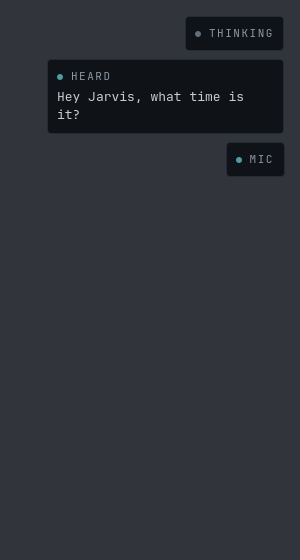
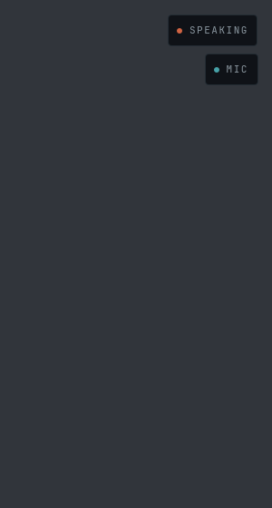
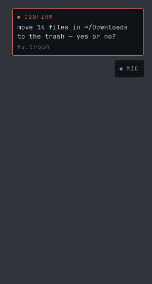
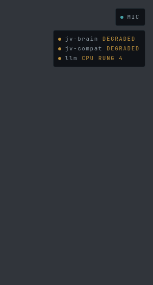
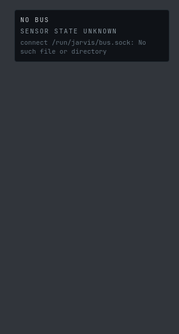

# The HUD, photographed

Generated by `bash ops/ralph/hudshots.sh`. Re-run it after any change to
`shell/jv-hud` and commit the diff.

Every element of this HUD was built, linted and tested without anyone ever
seeing it: the loop that writes it runs in a sandbox with no compositor, so
"the surface maps" has always been verified by construction rather than by
sight. Five open plan items (A13, A21, A22, A25, A27) are blocked on a human
eye and not on any code. This directory is an attempt to hand that person
something to look at without sitting at the machine.

## What you are looking at

Each PNG is **one HUD surface, at its real size** — 300 × 560 px, the box
`shell.qml` asks the compositor for, anchored top-right. The empty two thirds
is not a crop artifact; it is §06's earned emptiness, and it is most of what
this HUD looks like most of the time.

The plates are the real files. So is `Theme`, generated from
`personality/theme.toml`, and so are the faces — JetBrains Mono and Archivo,
pinned from the flake so a missing font cannot quietly become a different
look. Every frame goes in as a JSON line through the same
`core/BusModel.qml` the running HUD uses.

**The grey behind the plates is not the HUD.** The real surface is
transparent and floats over whatever Niri has on screen; the PNG needs
something behind it or the plate translucency (`plate_opacity = 0.86`) is
invisible. It is a flat neutral that appears nowhere in the palette, and a
test keeps it that way.

**What this is not.** Not the compositor: layer-shell, the empty input mask,
the zero exclusive zone, focus behaviour and the three real monitors are
`shell.qml`'s, and only a human at ares can confirm them. This is the
CONTENT of one surface.

## The sheet

Frames are either **recorded** — replayed verbatim from
`harness/fixtures/sessions` (PLAN B3), what jv-ears really published while
listening to a committed WAV — or **composed**, written by hand because
nothing in the repo has ever recorded that part of a turn. The difference
matters: a composed picture is a picture of an intention, and only a recorded
one is evidence about the machine. Closing that gap is what B10/A28 ask for.

### 01 — all quiet


`composed` (a bare bus-up line). A HUD that can see the bus and has nothing
to say. On a real machine the surface is not merely empty, it is *unmapped*:
zero frames, no compositing cost, your desktop untouched. This is the
ordinary state of the HUD and the one you should judge it by first.

### 02 — listening


`recorded` — `hey-jarvis-clean`, replayed to the wake word at 1.44 s; the
`MIC` heartbeat under it is composed, because no recorded session carries
`sys.health` at all. Teal, not ember: `personality/theme.toml` reserves the
cooler voice for YOUR state, and the open microphone is yours.

### 03 — heard



`recorded` — the same session in full, through jv-ears' final transcript;
the `brain.request` and the `MIC` heartbeat are composed. The words are what
faster-whisper actually returned. THINKING is the gap between Jarvis having
your question and you hearing anything back (A12), and the line under it is
what A26 added: the commonest failure of a voice assistant is that it heard
something else, and until now that was invisible until it came back as a
wrong answer.

### 04 — speaking



`composed` — the recording, plus a `speech.state` `speaking` frame written
by hand. **Nothing committed has ever recorded jv-voice speaking**, so this
one frame is the boundary between what the repo knows and what it assumes.
One real spoken turn recorded off the live bus (`harness/record.py`) would
replace it, and would also be the first recording that could show the heard
line LEAVING. That is PLAN B10/A28, and it needs one person and one
utterance.

### 05 — confirm



`composed`. jv-act stopping in front of a destructive tool, in its own words,
with a 15 s window running. The only thing this HUD ever shows that is
waiting on YOU — and until A20 it was spoken and nothing else, which means it
was a confirmation you answered by guessing. The plate takes no input at all
(the surface's input region is empty): answering stays with your voice and
`jv confirm`.

Two open questions are about this picture: the window closing is a real
signal and nothing on screen encodes it (A21), and granted / denied / timed
out all exit the same way (A22).

### 06 — health



`composed`. The short list — what is not well, worst first — and the llm rung
read off jv-brain's own heartbeat, which is the single number that explains
why Jarvis got slow. On a machine where everything heard from says `ok`, this
plate is not on screen at all.

### 07 — no bus



`composed`. The HUD saying it has stopped being able to see the machine
(A23). Every plate here refuses to guess rather than inventing — and a
refusal draws exactly the same nothing a calm machine draws, so without this
line a dark recording light over a microphone the HUD simply cannot see would
read as "off". It waits 5 s first: a reconnecting bridge is not a lost
machine. It cannot yet say how long it has been blind (A25).

## Regenerating

```
bash ops/ralph/hudshots.sh          # writes docs/hud/*.png
bash ops/ralph/runtests.sh tools    # the gates that keep the sheet honest
```

The harness stages a copy of `shell/jv-hud` with exactly two files replaced —
`Bus.qml` and `Motion.qml`, the only two that import Quickshell, whose QML
plugin is linked into the quickshell binary and cannot be loaded by any other
engine. `tools/hudshots/` holds those two stubs and the scene;
`tools/tests/test_hudshots.py` fails if the stubs stop offering what the real
files do, if the scene's plate stack drifts from `shell.qml`'s, or if a shot
is taken and never committed.

The PNGs themselves are not byte-compared against anything — a pixel
assertion breaks when a font ships a new version, and the point of this
directory is a picture a person can look at, not a comparison a machine can
make.
