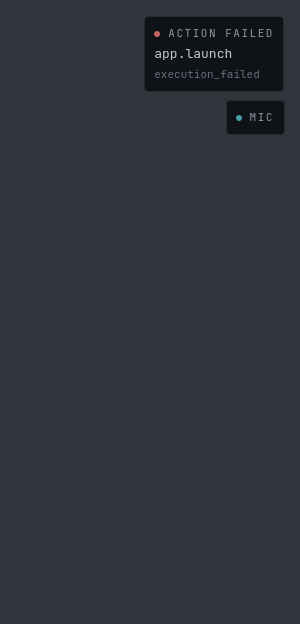
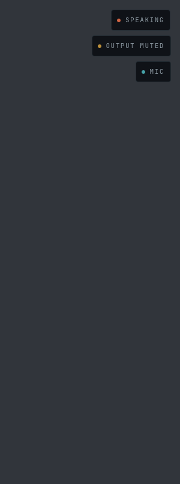
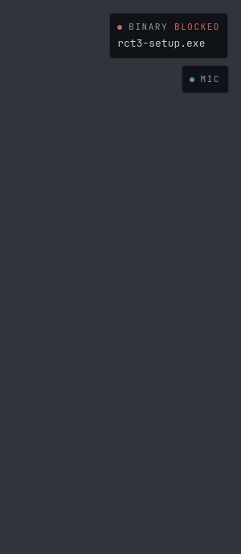
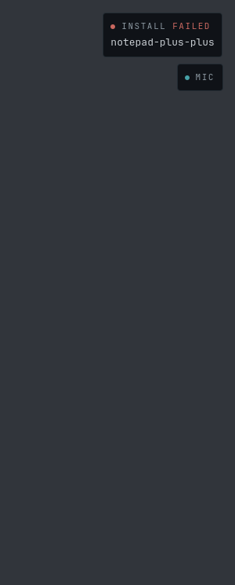
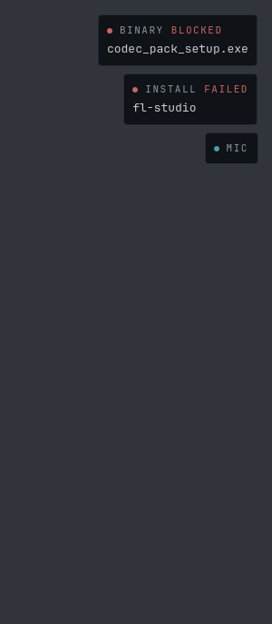
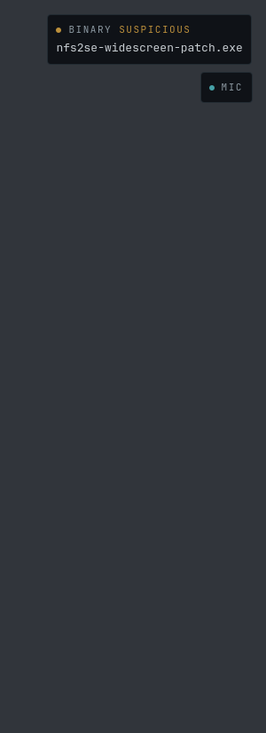
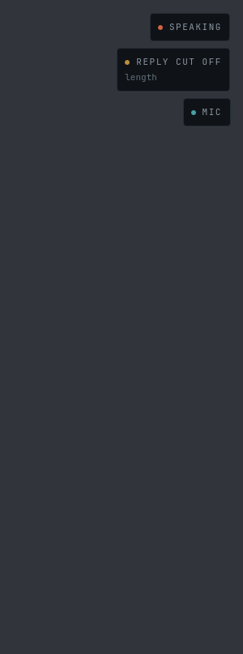
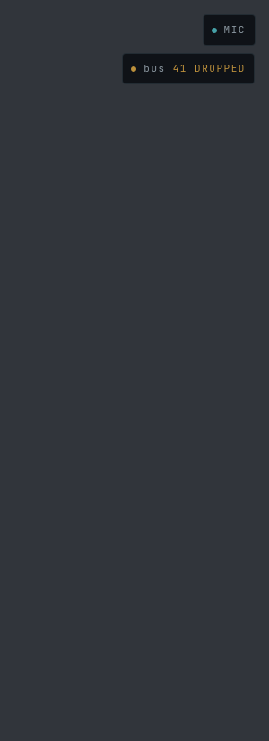
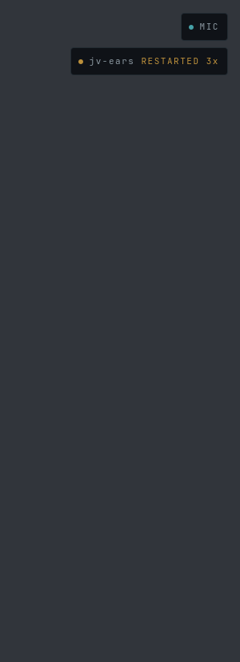

# The HUD, photographed

Generated by `bash ops/ralph/hudshots.sh`. Re-run it after any change to
`shell/jv-hud` and commit the diff.

Every element of this HUD was built, linted and tested without anyone ever
seeing it: the loop that writes it runs in a sandbox with no compositor, so
"the surface maps" has always been verified by construction rather than by
sight. Five open plan items (A13, A21, A22, A25, A27) are blocked on a human
eye and not on any code. This directory is an attempt to hand that person
something to look at without sitting at the machine.

## What you are looking at

Each PNG is **one HUD surface, at its real size** — 300 × 826 px, the box
`shell.qml` asks the compositor for, anchored top-right. The empty two thirds
is not a crop artifact; it is §06's earned emptiness, and it is most of what
this HUD looks like most of the time.

That box is not typed twice. A test reads it back out of this sentence and
holds it against the box the scene renders, which is held against
`shell.qml` — because the same sentence in `screens/README.md` said a
different size for four growths of the surface, and no reader could have
known which of the two was the HUD.

The plates are the real files. So is `Theme`, generated from
`personality/theme.toml`, and so are the faces — JetBrains Mono and Archivo,
pinned from the flake so a missing font cannot quietly become a different
look. Every frame goes in as a JSON line through the same
`core/BusModel.qml` the running HUD uses.

**The grey behind the plates is not the HUD.** The real surface is
transparent and floats over whatever Niri has on screen; the PNG needs
something behind it or the plate translucency (`plate_opacity = 0.86`) is
invisible. It is a flat neutral that appears nowhere in the palette, and a
test keeps it that way.

**What this is not.** Not the compositor: layer-shell, the empty input mask,
the zero exclusive zone, focus behaviour and the three real monitors are
`shell.qml`'s, and only a human at ares can confirm them. This is the
CONTENT of one surface.

**And not a sequence.** Every picture here is one settled instant, so the
class of bug it cannot show is the one this corner can actually have: a plate
that arrives a frame late, leaves a frame early, blinks in the middle of an
utterance, or comes up in the wrong order relative to the plate it qualifies.
That part is asserted rather than photographed —
`tools/hudshots/scene/tst_sequence.qml` (PLAN A54) replays the same recordings
through the same plates and checks the corner's whole trajectory: which plates
go up, in what order, at which second of a real turn. It runs beside the sheet
in `ops/ralph/hudshots.sh`, and both drivers build the same corner
(`tools/hudshots/scene/Corner.qml`, pinned to `shell.qml`'s stack by a test).

## The sheet

Frames are either **recorded** — replayed verbatim from
`harness/fixtures/sessions` (PLAN B3), what jv-ears really published while
listening to a committed WAV — or **composed**, written by hand because
nothing in the repo has ever recorded that part of a turn. The difference
matters: a composed picture is a picture of an intention, and only a recorded
one is evidence about the machine. Closing that gap is what B10/A28 ask for.

**A composed frame still quotes somebody.** Nine of these thirteen frames
put words in another service's mouth — jv-guard's verdict, jv-compat's
lifecycle, jv-act's error, jv-brain's rung, the question jv-act asks — and
"composed" says only that nobody recorded it, not that the named service
could ever have said it. Where the producer can be read without running it,
those words are now pinned to it: `tools/tests/test_hudshots.py` imports
jv-guard's scanner and jv-brain's ladder, parses jv-compat's installer,
evaluates jv-compat's own refusal expression over the verdict in the
picture, and reads jv-act's registry and Rust for the tool names, argument
names, error words, confirmation window and question format (PLAN A66, A67).
Three frames were wrong when that gate first ran, and shot 08 says which.

**What stays only plausible**, and is called out in the shot that carries
it: free text. An installer's stderr (shot 11), a service's `notes` (shot
06), a tool's registry description (shot 05) and gtk-launch's not-found
message (shot 08) are composed sentences that no reviewed source in this
repo fixes. They are shaped like the real thing and are not the real thing.

Each shot also carries an **On screen:** line — the plates that are lit in it,
top to bottom. That line is not prose: it is read off the harness by
`tools/tests/test_hudshots.py` and checked against what the plates themselves
report, because four of them (`health`, `action`, `guard`, `install`) draw
the same two lines in the same severity colour in the same corner, and
telling those apart in a PNG has always needed a person (PLAN A53).

### 01 — all quiet


**On screen:** nothing — the surface is not merely empty, it is unmapped.
This is the HUD's ordinary state.

`composed` (a bare bus-up line). A HUD that can see the bus and has nothing
to say. On a real machine the surface is not merely empty, it is *unmapped*:
zero frames, no compositing cost, your desktop untouched. This is the
ordinary state of the HUD and the one you should judge it by first.

### 02 — listening


**On screen:** `state` · `mic`

`recorded` — `hey-jarvis-clean`, replayed to the wake word at 1.44 s; the
`MIC` heartbeat under it is composed, because no recorded session carries
`sys.health` at all. Teal, not ember: `personality/theme.toml` reserves the
cooler voice for YOUR state, and the open microphone is yours.

### 03 — heard


**On screen:** `state` · `heard` · `mic`

`recorded` — the same session in full, through jv-ears' final transcript;
the `brain.request` and the `MIC` heartbeat are composed. The words are what
faster-whisper actually returned. THINKING is the gap between Jarvis having
your question and you hearing anything back (A12), and the line under it is
what A26 added: the commonest failure of a voice assistant is that it heard
something else, and until now that was invisible until it came back as a
wrong answer.

### 04 — speaking


**On screen:** `state` · `mic`

`composed` — the recording, plus a `speech.state` `speaking` frame written
by hand. **Nothing committed has ever recorded jv-voice speaking**, so this
one frame is the boundary between what the repo knows and what it assumes.
One real spoken turn recorded off the live bus (`harness/record.py`) would
replace it, and would also be the first recording that could show the heard
line LEAVING. That is PLAN B10/A28, and it needs one person and one
utterance.

### 05 — confirm


**On screen:** `confirm` · `mic`

`composed`. jv-act stopping in front of a destructive tool, in its own words,
with a 15 s window running. The only thing this HUD ever shows that is
waiting on YOU — and until A20 it was spoken and nothing else, which means it
was a confirmation you answered by guessing. The plate takes no input at all
(the surface's input region is empty): answering stays with your voice and
`jv confirm`.

**In its own words, and they are generic.** This picture used to read *move
14 files in ~/Downloads to the trash* — a machine that tells you what it is
about to touch. jv-act is not that machine: it sends
`format!("{} — yes or no?", spec.description)`, which is the tool's REGISTRY
description and a fixed tail, the same sentence for every invocation of that
tool. A67 found it and this is the question that will really be on screen.
The window and the `kind` are jv-act's own, read out of its source by the
same gate.

**One thing here is not jv-act's: `fs.trash` is not in its registry.**
`services/jv-act/tools.toml` is v0 — "observe + benign only" — so it holds
no destructive tool at all, and the confirmation rule is structural: only
destructive and privileged tools are ever confirmed. Asked for `fs.trash`
today the real jv-act would answer `unknown_tool` and ask nobody anything.
The machinery in this picture is built and reviewed; the tool it is holding
is one the registry has not been granted yet, and the description in the
question is therefore composed — written in the registry's own voice
("Launch an application", "Close a window"). A test fails if that stops
being said, and also if the registry ever gains the tool and makes it wrong.

Two open questions are about this picture: the window closing is a real
signal and nothing on screen encodes it (A21), and granted / denied / timed
out all exit the same way (A22). A third arrived with the sentence above: a
question that cannot name its object is a question a user may not be able to
answer, and whether that is jv-act's summary to widen or the HUD's args to
draw is a decision for a human (PLAN A68).

### 06 — health


**On screen:** `mic` · `health`

`composed`. The short list — what is not well, worst first — and the llm rung
read off jv-brain's own heartbeat, which is the single number that explains
why Jarvis got slow. On a machine where everything heard from says `ok`, this
plate is not on screen at all.

Rung 4 is the CPU floor of the five-rung ladder in `jv_brain/config.py`, and
`llm_gpu: 0` is what jv-brain writes for a rung that is not on the GPU —
both checked against that ladder, so a frame claiming rung 4 *on* the GPU
would be a picture of a fallback that did not happen. The metric names are
jv-brain's too: `metrics` is free-form by schema, so a key nothing publishes
is a key `jv health` would never print. The `notes` under them are free text
and composed.

The dim line under the rung is the *why* (B40), off `context.system`'s
`gpu_vram_free_mb` — the field jv-context started measuring in B37 and
nothing read until now. **943 MiB is not a composed number**: it is what ares
measured, twice in one week, on a healthy 6 GB GTX 1660 SUPER whose VRAM the
desktop and a browser had already spent. Without it the rung line reads as a
fault worth chasing; with it, it reads as the ladder in invariant 6 doing
exactly its job. It appears only under that line — a free-VRAM readout on
screen all day is the gauge §06 refuses — and on a machine with no GPU there
is no such field, so the rung line stands alone rather than being explained
by a shortage that does not exist.

The line under *that* is what the card would have to give back (B46).
`5424 MiB` is not composed either, and it is not the HUD's arithmetic: it is
`launcher.gpu_floor_mb` — the least free VRAM at which jv-brain's ladder
would still land on a GPU rung, `min()` over the GPU rungs of the same five,
in whole MiB rounded up — published on its own heartbeat as
`llm_gpu_floor_mb` and recomputed off that ladder by a test, so a picture of
a requirement jv-brain would not make fails rather than prints. Two numbers,
two publishers, one row each: jv-context measured the card, jv-brain
computed what its ladder wants, and the HUD puts them one above the other
and stops. It does not subtract them, colour one against the other, or
suggest restarting anything — the ladder is jv-brain's configuration and
invariant 1 keeps it on jv-brain's side of the wall. What the pair buys is
that `943 MiB free` stops being a figure you have to know this machine to
judge: **943 against 5424 is the ladder working**, and the day a closed game
makes those two numbers meet is visible at a glance. The requirement never
appears without a reading beside it — a number with nothing to compare it to
is jv-brain's own rule for its `notes`, and it is this plate's for its rows —
and jv-brain withholds it entirely once the brain is on the card, or on a
machine that has no card to free.

### 07 — no bus


**On screen:** `link` — and nothing else, which is the point: every plate
under it gates on the bus whose loss it is reporting, so the open microphone
from a second ago is gone rather than left up as a stale claim about the room.

`composed`. The HUD saying it has stopped being able to see the machine
(A23). Every plate here refuses to guess rather than inventing — and a
refusal draws exactly the same nothing a calm machine draws, so without this
line a dark recording light over a microphone the HUD simply cannot see would
read as "off". It waits 5 s first: a reconnecting bridge is not a lost
machine. It cannot yet say how long it has been blind (A25).

### 08 — action failed



**On screen:** `action` · `mic`

`composed`. The end of the story the plates above tell: Jarvis reached into
the machine and the machine did not move (A37). Invariant 3 gives exactly one
process the right to change this computer, and until now the HUD could show
the question jv-act asks before a destructive tool and never the outcome of
any tool at all — so "it did it", "it broke" and "nothing was ever asked"
were the same empty corner, and the only report on any of them was a sentence
the language model composed afterwards.

`risk`, not ember: ember means Jarvis is doing something, and this is the
opposite. The tool's registry name is verbatim, because it is the same string
`jv act-log` and the audit log use — what you read here is what you can go
and grep for — and the reason is the schema's own enum word rather than a
friendlier paraphrase nobody could look up.

Two things are deliberately NOT in this picture. Successes: an action that
worked draws nothing, because the machine visibly doing the thing is the
report that it was done (the HealthPlate argument). And `denied` /
`confirm_timeout` — those are how a *confirmation* ended, which is A22's open
question and not this plate's to answer as a side effect.

The composed frames behind it also carry `args` (`{"app": "obsidian"}`) and
`detail` (gtk-launch's not-found message), which is the point: the bridge
forwards whole envelopes, and neither field is on screen. A tools gate fails
the build if any element under `shell/jv-hud/core` so much as names them.

**Three of those fields were wrong until A67 asked the producers.** The
intent passed `args.name` where jv-act's registry declares `app` — the real
jv-act would have answered `invalid_args` and never reached an executor. It
omitted the `needs_confirmation` jv-brain always derives from the
capability. And the detail read `exec: "obsidian": executable file not found
in $PATH`, which is a Go runtime's sentence about execing a binary directly:
jv-act is Rust, and `app.launch` plans `gtk-launch -- <app>` and never execs
the application at all. None of the three reaches a pixel, which is exactly
why nothing had ever caught them — the picture was right and the machine
behind it was fiction. The tool name, its arguments, the capability and the
error word are now read out of `tools.toml` and `service.rs`; the sentence
gtk-launch prints is still composed, because nothing here has ever run it.

### 09 — output muted



**On screen:** `state` · `output` · `mic`

`composed`. Jarvis answering into a sink nobody can hear (A40). Read it top
to bottom: SPEAKING is true — jv-voice really did accept the utterance,
Piper really did synthesise it, PortAudio really did play it — and the room
was silent the whole time. Every service in this picture reports `ok`,
nothing errored, the audit log is clean, and the only thing wrong is a
toggle somewhere else on the machine. That is what makes it the failure with
the least evidence attached, and why the word above it needed a second line
underneath it rather than a different colour.

`warn`, not `risk`: nothing is broken. The two words are two different
controls — OUTPUT MUTED is a toggle, OUTPUT AT ZERO is a slider — because a
single "no sound" would send you to the wrong one half the time. There is no
threshold on "too quiet": that would be a guess about your speakers and your
room, and it would put a plate on screen for a machine you deliberately
turned down.

The frames are a `speech.state` `speaking` (composed, for the same reason
shot 04 is — see B10/A28), one `context.system` snapshot, which is
jv-context's 1 Hz view of the default sink, and one jv-voice heartbeat
carrying `output_device_pinned: 0` (A41). The heartbeat is what makes the
other two mean anything: the plate's claim is that the DEFAULT sink is the
device Jarvis plays into, which is true only while jv-voice has not been
pointed at one, so the element says nothing at all until jv-voice has
published that it took the default. Drop that frame and this tile goes
dark — which is what it does on a machine where somebody pinned a device,
and is the whole point. It is the first non-event topic
the HUD subscribes to, and the element reads exactly two of its fields:
`audio_muted` and `audio_volume`. The rest of that body — load, memory, net,
free VRAM — rides the pipe because envelopes are forwarded whole and is read
by nothing.

### 10 — a binary refused



**On screen:** `guard` · `mic`

`composed`. `jv-compat install rct3-setup.exe`, and jv-guard says no.
Invariant 8 — Windows binaries are untrusted by default — is the rule that
makes this the one moment JarvisOS refuses something its user asked for, and
until this plate existed the refusal happened entirely off screen: a verdict
on the bus, a terminal error, and a HUD showing the same empty corner it
shows for a machine nobody has asked to install anything.

`BLOCKED` is jv-guard's own word out of a frozen enum, in `risk` because the
verdict is final; a `suspicious` one draws the same plate in `warn`, because
the confirmation flow may still override it. The file's own name is the
brightest line, and nothing else of the path is drawn — it is the identity
you need at a glance, and the rest is more of your filesystem than the
question requires on a panel above every window. When a frame carries no
path at all the plate shows the first twelve hex of the sha256, labelled as
a hash, which is what jv-guard's log uses and the only thing about a file
that ever leaves this machine.

**What is deliberately not here: why.** `guard.verdict.reasons` carries
"matched ClamAV signature Win.Trojan.Agent-9823041" in this very frame, and
the schema says those reasons are *spoken on request*. They are also the one
string on this topic written by a scanner rather than fixed by a schema —
the same call `ActionPlate` makes when it draws `execution_failed` and never
jv-act's free-text detail.

**And one thing that is not visible in this picture at all:** the file name
is the only text in this HUD chosen by somebody hostile. A Linux file name
may contain newlines, control characters, or a bidirectional override that
makes `setup<U+202E>exe.bat` render as `setup.bat`. `core/GuardState.qml`
collapses whitespace, strips control and format characters and caps the
length before any of it reaches a `Text`, and a name with nothing left after
that is reported as no name at all — which falls back to the hash. Those
cases are asserted in `shell/jv-hud/tests/tst_guardstate.qml`, where a
result can be compared; this shot is the ordinary one, which is what a sheet
is for.

### 11 — an install that failed



**On screen:** `install` · `mic`

`composed`. The other half of the shot above it. jv-guard let this installer
through, jv-compat built it a confined prefix, ran it silently inside — and
Wine could not load a DLL it wanted. `jv-compat install` is a
fire-and-forget command that takes minutes, so by the time that happens the
terminal that started it is behind three windows and the user is somewhere
else entirely. The HUD is not.

`INSTALL FAILED` is the schema's own event word, in `risk` like every other
line in this HUD that reports something stopped. Under it is the app's
slug — `notepad-plus-plus`, the name of the Wine prefix jv-compat built and
the thing you would type to try again.

**Two frames went in and one plate came out.** The scene also publishes the
`prefix_created` that preceded the failure, and it draws nothing: an install
that is merely *running* is invisible here, along with `fingerprinted`,
`screened` and `installed`. That is `§06`'s earned emptiness, and it is also
a question left deliberately open — an install is the one thing on this bus
that takes minutes, so "what is jv-compat doing right now" may well deserve
a progress indicator, and what that should look like is a decision for a
human (PLAN A52) rather than a shape to arrive at by accident.

**What is deliberately not here: the installer's own words.** This frame's
`error` field reads `wine: could not load kernel32.dll, status c0000135`,
and it reaches no pixel. On a `failed` frame that field is the last 500
bytes of the confined Windows binary's stdout — free text written by the one
thing invariant 8 calls untrusted outright, likely carrying paths out of
this filesystem. `core/InstallState.qml` does not expose it at all, so no
plate can draw it; asking *why* is what your voice is for. The 500 bytes are
jv-compat's own truncation and are checked; the Wine sentence inside them is
composed, and is the one part of these two install shots that no source in
this repo fixes. Everything else about them is: the event words, the fields
each event carries, the installer framework and the architecture all come
out of `jv_compat/install.py` and `jv_compat/fingerprint.py`, and in shot 12
the refusal jv-compat reports is evaluated from jv-compat's own expression
over the verdict jv-guard is shown giving (A67).

**And one thing that is not visible in this picture:** the slug is checked
rather than trusted. jv-compat builds it out of the installer's file name,
which is a string its author chose, so the element draws it only if it still
has the shape of a prefix directory name — one line, no separators, short
enough to be a directory. Anything else is refused outright rather than
repaired, because a scrubbed identifier is another app's name, and the shot
falls back to the sha256 prefix. Those cases are asserted in
`shell/jv-hud/tests/tst_installstate.qml`, where a result can be compared;
this shot is the ordinary one, which is what a sheet is for.

### 12 — a refusal during an install



**On screen:** `guard` · `install` · `mic`

`composed`. The two plates above this one, at the same time — which is the
picture the surface box was grown for and the one nothing here had ever
shown (PLAN A61). `shell.qml` went from 624 px to 688 px twice on the
argument that a refused binary and a failed install can genuinely be up
together; this is that argument, rendered, and the assertion under it is
now that the whole stack fits the box rather than that it looks fine.

Two plates is not the case the box is sized for, though, and the fit check
on a three-plate picture clears it by hundreds of pixels. The case — every
plate that can be up at once, each drawing the widest thing its own cap
allows — is measured in `tools/hudshots/scene/tst_fit.qml` (PLAN A63), and
the first time it ran the corner was **713 px in a 688 px box**: the HUD
was cropping its own bottom plate, which is `HealthPlate`, the one that
says what is wrong. The surface is two insets plus that measurement now, and
no picture of that corner is taken here on purpose: a photograph of nine
unrelated plates 8 px apart is a picture of the question A62 is asking a
human, not an answer to it.

Adding `ReplyPlate` (shot 14, PLAN A71) moved the measurement again: the
crowd was **775 px** and the surface **807**. Adding the drop row (PLAN A75)
moved it once more, and this time without a plate: one 11 px row inside
`HealthPlate`, saying that the bus threw frames away, makes the crowd **794
px** and the surface **826**. That is worth reading alongside A70, which asks
whether a corner that tall should exist at all — it is now well past half a
1440p screen, and neither change answered the question. What the second one
adds to it is that a row is not cheaper than a plate: per line, the box pays
the same.

**It is not the sequence A61 assumed, and finding that out is most of what
this shot bought.** The obvious story is a refusal and a retry: jv-guard
blocks an installer, you fetch a different build, that one fails. It cannot
produce this picture. jv-guard screens the second build too, and a `clean`
verdict is newer news from the same screener — `core/GuardState.qml` reports
*the last binary screened*, so the refusal is gone from the corner before the
retry ever gets as far as failing. For both plates to be up, the refusal has
to be the NEWER screening and the failure has to belong to some other binary.

Which is exactly what two overlapping installs look like, because
`jv-compat install` takes minutes and nobody watches it:

```
t=0      jv-compat install flstudio_win64_21.2.exe
         fingerprinted → guard.verdict clean → screened → prefix_created
         … and then minutes of silence while the installer runs in its prefix
t=200    a second binary off a download site, installed while that one runs:
         fingerprinted → guard.verdict BLOCKED → compat.install blocked
t=214    the first install, still going, dies inside its prefix: failed
```

Every frame is one `services/jv-compat/jv_compat/install.py` and
`services/jv-guard` really publish, in the order they publish them. The
`blocked` on `compat.install` at t=200 is the interesting one: it lands in
the middle of another app's lifecycle, and `core/InstallState.qml` reads it
as no news at all — a clearing event there would have wiped the failure that
arrives fourteen seconds later, and a *failure* there would have put the
wrong app's name on the plate. That rule is asserted in
`shell/jv-hud/tests/tst_installstate.qml`; this is the first time the shape
that makes it matter has been on a screen.

**What this picture shows that no test asked for: the corner is describing
two different binaries and says so nowhere.** `codec_pack_setup.exe` was
refused; `fl-studio` failed; they have nothing to do with each other, and
they are stacked 8 px apart in the same colour. A reader who assumes one
story reads it as "the thing that was blocked then failed", which is the one
sentence these two frames do not support. Every plate in this HUD is true on
its own and the corner has no grammar for relating two of them — that is
PLAN A62, and it is visible here rather than argued about.

### 13 — a binary that only looks wrong



**On screen:** `guard` · `mic`

`composed`. The same element as shot 10, one word and one colour apart — and
until very recently, a branch of `GuardPlate` that nothing on this machine
could reach. The approved policy has three rungs, `clean` / `suspicious` /
`blocked`, and for months `decide()` could return only the outer two: the
middle one existed in the schema's policy note, in jv-compat's override
message and in this plate's `warn` colour, and in no code path at all. A
picture of it would have been a picture of an intention.

`jv-guard` grew a local, hash-free **shape** engine (PLAN A64), and now it
has a producer. The file here is the case the rung is for: not malware — a
decade-old widescreen patch for a game, which its author ran UPX over to
make it one small download. ClamAV recognises nothing in it. It is also, byte
for byte, shaped like something hiding:

```
pe-shape: executable section 'UPX0' has no bytes in the file but claims
          512 KiB at run time (unpacks itself)
pe-shape: executable section 'UPX1' is also writable
          (W+X: it can rewrite the code it runs)
pe-shape: executable section 'UPX1' looks packed or encrypted:
          entropy 7.98 of a possible 8.00 over all of it
```

`blocked` would be a lie about this file and `clean` would be a promise
nothing here can make, which is the whole argument for a middle rung.

**Those three sentences reach no pixel, and that is the plate's rule rather
than this shot's omission.** `core/GuardState.qml` never reads `reasons` —
`schemas/guard.verdict.json` says they are spoken on request, and they are
the one string on this topic written by a scanner rather than fixed by a
schema. What a glance gets you is that a binary was refused, which one, and
in which of two colours. They are quoted here because a reader of the sheet
deserves to know what the machine has to say when asked.

**The frame is composed and its words are not.**
`tools/tests/test_hudshots.py` builds a PE of exactly this shape, runs the
real `PEHeuristicScanner` and the real `decide()` over it, and compares the
verdict, the three reasons and `scanned_by` to the literal in the scene. The
picture cannot drift into showing a sentence jv-guard no longer says. Note
`scanned_by` in that frame: `clamav` **and** `pe-shape`, always both — the
shape engine is advisory, it may raise suspicion and may never grant trust,
so a `suspicious` verdict is by construction two engines' work.

**And the door in this picture has no handle.** `warn` rather than `risk`
means *the confirmation flow may still override this* — that is what the
colour is carrying, and it is what separates this shot from shot 10. Today
nothing has wired that override to this verdict, so a packed installer stops
here and the only thing on offer is a confirmation nobody can give. That is
invariant 8 behaving exactly as written (untrusted by default, fail closed),
and it is PLAN A65 asking a human which of three ways out to take.

### 14 — an answer that ran out of room



**On screen:** `state` · `reply` · `mic`

`composed`, over a real recording. The question is `hey-jarvis-clean`
replayed whole — the wake and the transcript are what jv-ears really
published — and the two frames that end the turn are written by hand, for
the same reason shot 04 is: nothing committed has ever recorded jv-voice
speaking or jv-brain answering (PLAN B10/A28).

`schemas/brain.response.json` ends every turn with one of three words, and
this is the only one with nowhere else to go. `stop` is the ordinary case and
draws nothing. `error` already reaches this corner: the same `except` block
in jv-brain that publishes it publishes a `degraded` heartbeat one `await`
later, and `HealthPlate` draws that — reporting it twice, in two colours, in
one corner is the confusion A62 is about. `length` means the context or token
limit was reached and **the text is truncated**, and until A71 nothing on
this machine said so: no service calls it a fault, so no heartbeat changes;
jv-brain speaks the reply as it streams, so there is no later sentence to put
the news in; and the frame that carries the word is a well-formed frame on a
healthy machine. The user simply hears the answer stop.

On ares that is not the exotic case. The brain runs on a CPU rung with a
2048-token context — invariant 6's ladder doing its job against the 943 MiB
of free VRAM in shot 06 — while the conversation budget is sized for rung 0
(`docs/optimization-backlog.md` §4). The limit is reachable in ordinary
conversation, and that backlog item is a human's to answer; this plate is
only the part the screen owes the user.

**`heard` is down, and that is an assertion rather than an omission.**
`HeardState` lets the words go the moment Jarvis starts answering, so a
caption reading `state` · `reply` · `mic` says the reply plate is up on its
own account and not riding a transcript that never left.

**`speaking` is stamped after the response, and that is the ordinary
order.** jv-brain publishes `brain.response` when the stream closes, and
jv-voice is still working through the sentences it was handed — which is
exactly why `core/ReplyState.qml` does not take this plate down when Jarvis
starts speaking, the way `ActionState` does. That frame would be the
truncated reply still being read out. The picture is of the decision as much
as of the plate.

**Not one word of the reply is on screen.** The text is in the frame, because
the bridge forwards whole envelopes, and it reaches no pixel: the HUD has a
place for what you were heard *saying* and none for what Jarvis said back.
What a glance gets you is that the answer stopped early, and the schema's own
word for why.

### 15 — the bus threw frames away



**On screen:** `mic` · `health`

`composed`. Every service on this machine says `ok`, the brain is on the card,
and there is not one finding in the list — the plate is on screen anyway,
because the bus dropped frames and `HealthState` cannot see that (PLAN A75).
This is the only shot on the sheet whose plate is up for a reason the element
that owns the plate does not know about.

`schemas/sys.health.json` has carried `drops` since v1 — "frames dropped since
the last heartbeat, keyed by topic. Published by jarvisd per slow subscriber;
empty/absent = none" — and `broker.rs` really fills it. Nothing in
`shell/jv-hud` read the field until this row: `seq` appears in eleven files
under `core/` and in every one of them it is an identity component, never a
gap check. So invariant 5's one failure — something blocked the bus long
enough that frames were thrown away — was visible to a human running
`jv health` and invisible on screen, under a corner every line of which is
drawn from the frames that arrived.

**`ok` beside a non-empty map is not a contrived frame.** `publish_health` in
`services/jarvisd/src/broker.rs` hardcodes `SysHealthState::Ok` in the same
body it drains the drops into, so this is what the broker writes while it is
losing frames — and `HealthState.rank("ok")` is 0, which is why the count
needed a row of its own rather than a place in the findings list. Whether the
broker should ever call itself impaired is PLAN A76, and it is a real
question: `degraded` on a per-interval counter flaps by construction, and
`jv health --check` would exit 1 on it.

**The total is composed; the keys are not.** Nothing on this machine has
measured a drop yet. The two keys behind the 41 are the broker's own — a
topic name for an out-queue overflow (`drops.add(&d.topic, 1)`) and `_lagged`
for a subscriber that fell so far behind the broadcast channel that the ring
wrapped — and **the picture shows neither**, which is the decision worth
reading. jarvisd sums every subscriber connection's tally into one map before
publishing, so the HUD may not be the reader that lost anything; a row
reading `audio.vad 38` would send someone after a perception service when the
fault is a slow consumer three processes away. The row says the bus dropped
something, says how many, and stops. The map itself is one `jv health` away,
which is the same answer B23 gives for `jv sub`. Whether the corner should
ever tell a lag from an overflow is PLAN A77.

The count is capped at four digits (`9999+ DROPPED`) for the reason every
figure in this corner is bounded: the surface is 300 px wide, sized to the
longest line any plate may draw, and a truncation that does not admit it
reads as a complete number.

### 16 — a service that keeps dying



**On screen:** `mic` · `health`

`composed`. The second shot on this sheet whose plate is up over a machine
where every service reports `ok`, and the reason is not 15's. There, a field
nothing read; here, **a fact no field carries**. Nothing on this bus says "I
was restarted" — the process that could say it is the one that just lost the
memory — so the only witness is `uptime_s` going backwards between two
heartbeats, which needs a reader that remembers the last one (PLAN A78).

**Why this machine is worth a picture.** Every unit in
`modules/jarvis-services.nix` is `Restart=on-failure`, and one of them says so
in a comment about a bug it is the recovery path for. So a jv-ears crashing
every few seconds looks, from the bus, like a well machine: the replacement
process heartbeats `starting` and then `ok`, `HealthState.rank("ok")` is 0,
and §06's earned emptiness — which has taught this HUD's reader that an empty
corner means nothing is wrong — draws exactly nothing. The microphone plate is
up beside it for the same honest reason: the device really is open, because
the new process opened it.

**`uptime_s` is the only required field of `schemas/sys.health.json` that
nothing in `shell/jv-hud` read.** `jv health` has printed it since the CLI
existed. It is monotonic within one process's life, so a heartbeat carrying
less of it than the last one from the same service was written by a different
process — and that is the whole inference. The frames behind this shot are six
heartbeats whose uptimes run 1847, 6, 9, 4, 7, 2: three falls, three deaths,
and a replacement two seconds old.

**The count is on the line, and that is the decision.** One crash at boot and
a service dying every eight seconds are the same event repeated, and only the
tally tells them apart — so `3x` is on the plate rather than left to
`jv health`. It is the only number in this corner that is a tally over time
rather than a reading, and it is capped (`RESTARTED 99+x`) for the reason
every figure here is bounded: the surface is 300 px wide.

**How long a restart is news** is `period_s * 2` — the same span this element
already believes one heartbeat for, read off the frame's own body, so nothing
here runs a timer. A service crash-looping inside that window never stops
reporting; one that restarted an hour ago says nothing until it does it again,
and then says `2x`. The tally is forgotten entirely when the bus link drops: a
HUD that could not see the bus does not know how many processes came and went
while it was blind.

**`restarted` is this file's own word**, like `lost` and `unknown` — a
heartbeat that publishes it is outside the frozen enum and comes out
`unknown`. It ties with `degraded` rather than outranking it: the service is
running and answering, which is what `degraded` names, and a list three lines
deep would otherwise push a jv-voice that cannot reach the speakers off the
plate for a jv-ears that crashed once at boot. A service with something worse
to say keeps its own word.

## Regenerating

```
bash ops/ralph/hudshots.sh          # writes docs/hud/*.png
bash ops/ralph/runtests.sh tools    # the gates that keep the sheet honest
```

The harness stages a copy of `shell/jv-hud` with exactly two files replaced —
`Bus.qml` and `Motion.qml`, the only two that import Quickshell, whose QML
plugin is linked into the quickshell binary and cannot be loaded by any other
engine. `tools/hudshots/` holds those two stubs and the scene;
`tools/tests/test_hudshots.py` fails if the stubs stop offering what the real
files do, if the scene's plate stack drifts from `shell.qml`'s, or if a shot
is taken and never committed.

**These PNGs are assertions now** (B52). `hudshots.sh` renders the sheet and
then reads it back, comparing every picture against the one committed here at
`HEAD` (`tools/hudsheet.py`). It used to not: the sheet was written and never
opened, and a mutation that painted the ember — the one accent §06 spends on
nothing else — on every state that is not idle left all thirteen photographs,
all fifteen driver assertions and all 585 QML tests exactly as they were.

The old worry was that a pixel assertion breaks when a font ships a new
version. It cannot here: the faces are pinned from the flake, and so is Qt, so
these bytes move when the HUD moves and not otherwise — which is the whole
point of A45 making them reproducible. When they do move, the script says
which shots moved, the box they moved in and three of the pixels by colour,
and leaves the new PNGs on disk. **That is the refresh**: look at them, commit
them, and the next run is green. If you did not change the HUD, something drew
a different picture than the one in this directory.
