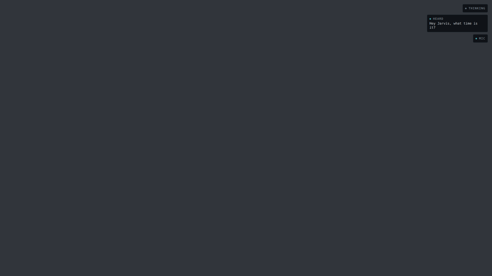

# The HUD, on three monitors

Photographs of the **real** `jv-hud` — quickshell, a layer-shell surface,
its own read-only bridge, a real `jarvisd` — running on a real wlroots
compositor with ares' monitor sizes. Written by `ops/ralph/hudscreens.sh`;
re-run it after any change to `shell/jv-hud` or `personality/theme.toml`
and commit the diff.

This is the companion to [`../README.md`](../README.md), and the two
answer opposite questions. That sheet renders the plates with a plain QML
engine into the 300x560 rectangle the surface declares: the HUD's
**content**, at a size you can read, and it has to disclaim everything a
compositor owns. These are **screens** — the whole desktop, all three of
them, with the HUD where it actually lands on it.

## What is real here, and what is not

Real: the shipped `jv-hud` binary, unmodified and unstaged; quickshell's
layer-shell surface; one surface per screen from `Quickshell.screens`; the
`jv-hud-bridge` child; a real `jarvisd` on a private socket; the frames,
which go over that bus and are read by the HUD the way any frame is.

Not real: the compositor is **sway**, not Niri — close enough for
layer-shell, which is the protocol both implement, and not the same thing
as ares. The outputs are **headless**: the right sizes, no scanout, no
panel, no NVIDIA, and named `HEADLESS-1..3` rather than ares' `HDMI-A-1`
and `DP-1`/`DP-2`. Nothing here can tell you whether an 11 px label is
comfortable from where you actually sit — only how much of the screen it
takes and where.

The desktop behind the HUD is flat `#31353B`, deliberately **not** a
`personality/theme.toml` colour, so the paper can never be mistaken for
Jarvis's own palette. Without something behind it the plates' `0.86`
opacity — the glass the whole panel is made of — would be invisible.

In the three-screen shots the black band below the right-hand two thirds
is not a colour choice: those monitors are 1080p and the primary is 1440p,
so there is simply no screen there. That is the desk.

## What the harness checks before it writes a PNG

The pictures are the deliverable, but the measurements are why this exists
rather than being a nicer version of the contact sheet. `shoot.py` fails
the run — no PNGs — unless all of the following hold, none of which any
QML engine can answer:

- **The HUD is on every monitor, in the corner it claims.** Everything
  drawn on each output falls inside the 300x560 box `shell.qml` anchors to
  the top-right, and the gap to the right edge is `inset_px`. *Verified it
  bites: anchoring the surface `left` instead of `right` fails; making one
  surface instead of one per screen fails.*
- **The keyboard never moves.** The seat's focused node is read with no
  HUD running and again while the HUD is drawing, and must be identical.
  *Verified: `WlrKeyboardFocus.Exclusive` fails.*
- **Earned emptiness is real emptiness.** The quiet shot must come back
  pixel-identical to the bare desktop, on all three monitors. *Verified: a
  health plate that shows a well machine fails.*
- **No space is reserved.** Each workspace's usable rect must still be the
  whole monitor. On today's corner-anchored surface this proves nothing —
  the protocol ignores an exclusive zone on a corner — and it is kept for
  the day the anchors change; `shoot.py` says so at length, with what was
  tried.
- **A click over the HUD reaches the window underneath.** An ordinary
  window is opened filling the primary monitor and a second one on a side
  monitor to hold the keyboard, and three points are clicked: one clear of
  the HUD (the control — without it a harness whose clicks went nowhere
  would report a perfect pass-through), one on a pixel the HUD actually
  painted, and one inside the 300x560 surface box that it painted nothing
  on. All three must end with the keyboard on the window under the HUD.
  *Verified: deleting `mask: Region {}` fails on the painted pixel; a mask
  covering only the lower, unpainted half of the box passes that one and
  fails the third.*

  This is the last of invariant 10's structural promises to stop being a
  reading of the source (A32), and it is worth being exact about what the
  measurement is. The window's own `wl_pointer` never fires: a headless
  seat has no input device, so it advertises no pointer capability and no
  client binds one. The button is synthesised through sway's IPC and the
  witness is **sway's own routing**, read back over IPC — which is the
  hit test, since `node_at_coords` consults each layer surface's input
  region before it ever looks at a window. The probe runs last (it puts
  windows on screen, and every photograph above needs a bare desktop) and
  with **no jarvisd at all**: it needs a lit HUD that does not expire, and
  a bus the HUD cannot see is the one thing it says indefinitely. *Verified
  that this cannot go vacuous: widening `LinkState.graceS` so the plate
  never arrives fails the probe rather than passing it — an unmapped
  surface passes every click whatever its mask says.*

- **A shot of two plates is a shot of two plates.** `04-unheard` is the
  first picture here whose subject is a *live reading* rather than an
  event, and it is photographed twice. First with an **audible** sink —
  which lights `StatePlate` and nothing else, because SPEAKING has been
  drawn off `jv-voice`'s frame alone since A3 — and then with the mute,
  and the drawn region must have grown *downwards* with its top and right
  edges unmoved. That is a plate arriving under another one on a stack
  docked to the corner. Without it, an `OutputState` that had stopped
  drawing would still produce a perfectly sharp photograph of one plate,
  under a caption describing a line that is not in it. (The left edge
  travels outwards, because OUTPUT MUTED is a longer line than SPEAKING.)

  The same shot is also the first one the harness has to **hold**. Every
  other picture here is of a frame that stands on its own for longer than
  a camera takes; `OutputState` believes a `context.system` snapshot for
  three of `jv-context`'s periods, and a heartbeat speaks for two of its
  own `period_s`. So the settle *is* a feed, at the 1 Hz `jv-context`
  publishes at all day.

  *Measured, rather than argued, because the argument overstates it:*
  publishing the pair **once** and sleeping writes the same picture
  today, byte for byte. One exposure reaches `grim` about two seconds
  after the publish and the snapshot expires at three, so publish-once is
  inside the window — by under a second, on this machine, with this
  shot's single capture. The feed is what stops that margin from being
  the thing that makes the picture right: the frames are true at the
  instant of every exposure whatever else is happening, and they stay
  true if the shot grows a second monitor (a 33 Mpx `grim` and a PNG
  encode each) or the settle gets longer. The far end of that margin is
  not hypothetical — the live-lit window below published a heartbeat
  once, and **jv-voice lost** arrived under the plate it was holding
  still.

- **The HUD renders nothing while nothing changes.** Commits are counted
  on the HUD's own side of the Wayland socket (libwayland's
  `WAYLAND_DEBUG` log) over **three** six-second windows, all of which
  must be **zero**:

  1. **quiet** — a live bus carrying a `context.system` snapshot every
     second that the HUD has nothing to say about. The surface is
     unmapped, and the question is whether a frame *arriving* is a frame
     *drawn*.
  2. **lit** — a plate on screen with no further input at all: no
     `jarvisd`, `LinkPlate` after `LinkState`'s grace. The first
     measurement of stillness as a property of what the elements *do*.
  3. **live and lit** — both at once, which is the state the HUD is
     actually in on a running machine. `jv-voice` says it is speaking and
     a muted snapshot arrives every second, so **SPEAKING** and
     **OUTPUT MUTED** sit on screen for the whole window while `seq` moves,
     `OutputState`'s expiry timer re-arms, and every binding downstream of
     the snapshot re-evaluates to the same value. A commit here would be a
     re-render on *bookkeeping* — the one way of spending the budget that
     neither window above can see.

  Measured: 0, 0 and 0. The fade-in that put the blind plate there cost 42
  commits across the three surfaces and then stopped; lighting SPEAKING and
  then OUTPUT MUTED under it cost 82 across the two steps, and the plate
  that arrived was 41 px taller than the one above it alone.

  Window 3 was impossible before A40. Every other lit state in this HUD is
  a frame ageing out — a heartbeat speaks for two of its own periods, a
  confirmation for the window `jv-act` declared — so the only thing a
  harness could hold still was a HUD with **no bus at all**, and that
  zero is partly a fact about the silence. `OutputState` is a live reading
  of two topics rather than a latch, so it stays true for exactly as long
  as the frames keep coming.

  *Verified that none of the three can go vacuous.* Each is paired with a
  stretch that must contain commits — the HUD being woken by a real
  jv-ears heartbeat, the blind plate arriving, the speaking/muted pair
  arriving — counted by the same code through the same log. That control
  is not decoration: it is what caught the first version of this probe,
  whose pattern expected `wl_surface@41` where this libwayland writes
  `wl_surface#41`, and which would otherwise have reported a flawless zero
  forever. The live-lit window carries two more guards of its own, because
  it has two more ways to lie. It is lit in **two steps** — an audible
  sink first, then the mute — and the drawn region then has to grow
  *downwards* with its top and right edges unmoved, which is what a plate
  arriving under another one looks like on a stack docked to the top-right.
  Otherwise the thing being held still might be `StatePlate` alone, with
  `OutputPlate` never having appeared. (The left edge does travel outwards:
  OUTPUT MUTED is a longer line than SPEAKING. The first version of the
  check called that a failure.) And the region is
  re-measured after the window and must be identical, because
  `OutputState` stops believing a snapshot after three of `jv-context`'s
  periods: a window that stopped feeding would watch the plate leave, and
  an unmapped surface commits nothing. *Both were verified by mutation:
  replacing the feed with a plain sleep fails on the box, which had shrunk
  back to SPEAKING alone.*

  *Verified that window 3 catches what windows 1 and 2 cannot.* The
  mutation is a "freshness" fade — the dot's opacity bound to the age of
  the snapshot, which is the kind of considerate edit nobody would look at
  twice. There is no animation in it and no timer: the binding re-runs
  only when a new frame lands, which is once a second, forever, on a
  running machine. The drawn box never moves and the photographs are
  identical. The quiet window read **0** (the surface is unmapped), A34's
  lit window read **0** (no bus, so no snapshots), and the live-lit window
  read **18** — three surfaces times six seconds. An infinite
  `SequentialAnimation` inside the same plate, by contrast, is caught by
  the lit window too: an animation runs whether or not anyone can see it,
  and that is the failure the first two windows were already built for.

  This is invariant 10's cost claim — §06 budgets the ambient scene at
  "under 2 ms of GPU per frame and near-zero when nothing changed", and
  asks that an idle desktop render at 0 fps rather than 60. It is worth
  being exact about which half of that was measured. Only the second. This compositor renders with **pixman**, in software,
  on a headless backend: no frame here took any time on a 1660 SUPER, and
  nothing in this harness can tell you what the ambient scene costs on
  one. What it can tell you is whether the HUD asks to be drawn at all
  when the machine is quiet — which is the half an ordinary edit can take
  away without looking wrong. A plate that pulses, a duration that counts
  up, a `NumberAnimation` left on `loops: Animation.Infinite`: each reads
  as correct in a diff, is invisible in a photograph, and costs a
  composite of three monitors forever.

No pixel colour is asserted anywhere. A font ships a new version, Qt
changes its rasteriser, and a byte comparison fails in a way nobody can
read.

Two runs of an unchanged HUD are **not byte-identical**, and the numbers
are worth stating because a journal entry has already read a clean
`git status` here as evidence that nothing moved (A45). Re-running this
harness against an untouched `shell/jv-hud` changes `02-heard` and
`03-confirm` by a **handful of pixels per monitor** — single values, one
channel, on antialiased glyph edges inside the plate. Over three runs,
`01-quiet` (which draws nothing) and `04-unheard` (two short monospace
labels) came back byte for byte every time, and the two shots carrying a
long wrapped sentence never did. So a dirty `git status` after a
re-run is not a regression and a clean one is not a pass. Look at the
picture; the measurements above are what the run actually asserts.

---

### 01-quiet-desk.png

**Recorded** from a live bus with nothing published on it. jarvisd is up,
the bridge is subscribed, and every plate has looked at the bus and
decided it has nothing true to say — so all three surfaces stay unmapped
and the screens are just the desktop. This is the HUD's ordinary state,
and the fact that this picture is boring is the whole of §06's earned
emptiness. It is also the control: every other shot here is measured
against it.

### 02-heard-desk.png

**Recorded** — `harness/fixtures/sessions/hey-jarvis-clean.jsonl`, the
real wake word and the real transcript, replayed whole onto the live bus —
plus a **composed** jv-ears heartbeat (for the microphone counters) and a
composed `brain.request`, because nothing committed has ever recorded
`sys.health` or a turn reaching jv-brain (B10/A28).

This is the picture **A13 and A27 are blocked on**: the same THINKING, the
same "Hey Jarvis, what time is it?", the same MIC, three times, once per
screen. Right or noise — that is the question, and it is now a question
you can look at instead of imagine. Note that it is your own sentence
being repeated, which is the part A27 minds more than A13 does.

### 02-heard-primary.png

The same recorded moment on the 2560x1440 primary, at its real size — the
same frames as the desk shot above, composed heartbeat included. How much
of a 1440p panel the HUD occupies, and how small an 11 px label is on one.

### 02-heard-side.png

The same recorded moment on a 1920x1080 side monitor, same frames and same
composed heartbeat. The plate is the same number of pixels on both, so it
is proportionally larger here — the contact sheet renders one plate and
cannot show that; two screens side by side can.

### 03-confirm-desk.png

**Composed** — nothing committed has recorded jv-act asking. The one thing
this HUD ever shows that is waiting on *you*, on all three screens at
once, with the only ember border in the design. If three copies of
LISTENING is a question, three copies of a question with a 15-second
window is a sharper one.

### 03-confirm-primary.png

The same composed request at real size on the primary. The summary is
jv-act's own sentence, wrapped to the plate's width, over the tool id —
and it can only be read: the surface takes no input at all, so answering
stays with your voice or `jv confirm` (invariant 3).

### 04-unheard-primary.png

**Composed** — nothing committed has recorded jv-voice speaking, and no
recording carries a muted mixer. The only picture in either sheet where
two plates **disagree about whether Jarvis is working**: the top one says
an utterance is in flight, the one under it says none of it is arriving.
Both are true. Of all the ways a voice assistant fails, this is the one
with the least evidence attached — no service is unwell, nothing errored,
the audit log is clean, and the only thing wrong is a toggle somewhere
else on the machine (A40).

The second line is on screen only because `jv-voice` published
`output_device_pinned: 0` in its heartbeat — it took the default output
device, so the sink `jv-context` can see is the one the samples land on
(A41). Pin a device and this plate goes dark rather than becoming a
confident statement about the wrong mixer.

The mic plate is absent, and that is the honest picture: nothing on this
bus published `jv-ears`' counters, and invariant 10's recording light is
not drawn on a guess.
