# The notification corner, photographed

Generated by `bash ops/ralph/notifyshots.sh`. Re-run it after any change to
`shell/jv-notify` and commit the diff.

This is the sibling of `docs/hud/`, and the shell it photographs is the one
that needed a sheet most (PLAN D20). Every other surface JarvisOS draws is fed
by the bus, and the bus is schema'd — `schemas/` says what a frame may contain
and `jarvisd` refuses anything else. A notification is the opposite: any
process with a D-Bus session may call `Notify` with any string, of any length,
in any script, and what it sends lands on a plate that floats over every window
and has an empty input region, so nothing on the machine can move it out of the
way.

"What does a toast do with a 4000-character summary, an app name that is one
unbroken 120-character word, or three criticals at once" is therefore not a
hypothetical, and until this sheet existed the only answer was qmllint's: that
the QML parses.

**The first run answered it, and the answer was bad.** `09-long-name.png` is
the shot that asks; the first time it was taken, the name row painted **656.5
px past a 320 px plate** — twice the plate's own width, over whatever window
happened to be under it, on a surface with no input region. The summary and the
body could never do that (both are width-bound and wrap); the name row is a
`Row`, which takes its width from its children. It is bound and elided now, and
the assertion that it stays that way is on every shot.

## What you are looking at

Each PNG is **one notification surface, at the size it would really be**. The
box is derived, not declared: `shell.qml` asks the compositor for
`stack.implicitWidth + inset·2` by `stack.implicitHeight + inset·2`, so a
corner holding one plate is a small surface and a corner holding three is a
tall one. The driver derives it the same way and asserts the two agree, which
is why these files differ in height and all share a width of 352 px (a 320 px
plate and a 16 px inset on each side).

There is **no "quiet" shot**, and that is a fact about this shell rather than
an omission: an empty corner is an *unmapped* surface (`visible:
Notifications.anyLit`), not a picture of anything. §06's earned emptiness is
the ordinary state of a notification daemon — most of a day has nothing in it —
and it costs exactly 0 fps because there is no surface.

The plates are the real `Toast.qml`. So is `Theme`, generated from
`personality/theme.toml`, so is the motion gate, and so are the faces —
JetBrains Mono and Archivo, pinned from the flake so a missing font cannot
quietly become a different look. Every notification goes in as the same record
the real D-Bus server builds and through the same `core/NotifyModel.qml` the
running daemon uses: the same cap of three, the same `earlier` count, the same
whitespace collapse.

**The grey behind the plates is not the corner.** The real surface is
transparent and floats over whatever Niri has on screen; the PNG needs
something behind it or the plate translucency (`plate_opacity = 0.86`) is
invisible. It is the same flat neutral the HUD's sheet uses, it appears nowhere
in the palette, and a test keeps it that way.

**Every shot here is composed.** Nothing in this repo has ever recorded a real
notification — there is no fixture format for one — so the strings below were
written to ask a question, not captured from a machine. That is said here
because a composed picture presented as a capture is worse than no picture.

**What this is not.** Not the compositor: layer-shell, the empty input mask,
the zero exclusive zone, the unmapped-when-empty surface and the three real
monitors are `shell.qml`'s, and only a human at ares can confirm them. Not a
daemon either — there is no D-Bus session here, so what a real sender's bytes
turn into on the wire is Quickshell's business and not tested by this. This is
the **content** of one surface.

## The sheet

Every shot is **composed** — see above. Each carries an **On screen:** line,
which is not prose: it is the caption `tst_shots.qml` asserts, read off the
plates themselves. A PNG of one plate looks almost exactly like a PNG of
another (the whole vocabulary is a dot, a name and two paragraphs), so that line
is what says a picture is a picture OF something.

### 01 — one

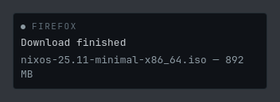

**On screen:** `normal` · name · summary · body

The ordinary case: one program, one thing to say. The name in quiet mono
caps — which program is talking to you is the first thing to know and the last
thing to shout — the summary in the brightest tier, the detail under it a step
quieter. Everything else on this sheet is a departure from this picture.

### 02 — low urgency, no body

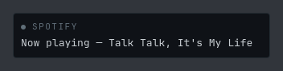

**On screen:** `low` · name · summary

`Low` drops the dot to `text_3`, the quietest of the three readings. This
sender sent no body, so there is no body row: a field the sender left out is
ABSENT rather than empty, and a one-line notification is a one-line plate.

### 03 — critical

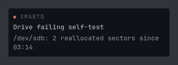

**On screen:** `critical` · name · summary · body

The `risk` dot — the only colour urgency gets, and the sender saying
something is wrong. Deliberately **not** the ember: every process with a D-Bus
session can send this and can put any string in `app_name`, including
"Jarvis", so a corner that spent the accent here would hand every program on
this machine the ability to dress up as the assistant. `Critical` is also the
one urgency allowed to stay until it is withdrawn (`dwellMsFor` returns 0 for
it), because losing it is the worse failure.

### 04 — the corner exactly full

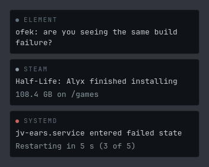

**On screen:** `low` · `normal` · `critical`, three plates — the cap

Oldest at the top, newest nearest the corner: the shortest distance from
where a message appears to where the last one did. All three urgencies at once,
so the dot column here is the whole vocabulary — and the argument for one
channel rather than three (no boxes, no icons, one place to look).

### 05 — five sent, three shown

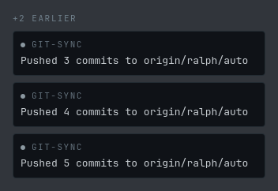

**On screen:** `+2 EARLIER`, then three `normal` plates

The cap is three. The two past it are not dropped and not hidden either —
the line above the stack counts them. It is the one thing a capped corner owes
the person reading it: a cap nobody is told about is indistinguishable from a
daemon that lost their notification. Compare this picture with 04: without that
line the two corners would be the same picture.

### 06 — 4000 characters

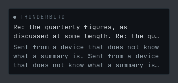

**On screen:** `normal` · name · summary**…** · body**…** — both elided

A sender that formatted its text for a dialog box. §06 gives a glance two
lines of summary and three of body, then an ellipsis, because longer than a
glance is a paragraph nobody reads standing up — and an elide is what makes a
truncated message look truncated instead of finished.

The ellipses in the caption are the assertion, not decoration: they are
`Text.truncated`, so this shot proves the elide HAPPENED rather than that it was
configured. A plate that grew instead would be a plate the height of the screen,
over your work, on a surface nothing can move.

### 07 — no app name

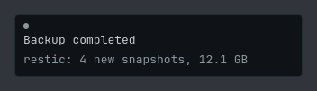

**On screen:** `normal` · summary · body — no name row

Apps do leave `app_name` empty. The row is hidden outright rather than
filled in: an anonymous notification says so by having no name, not by showing
the word "unknown". The dot sits alone on the top row and the summary is the
first thing read.

### 08 — markup and whitespace from a stranger

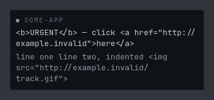

**On screen:** `normal` · name · summary · body

`bodyMarkupSupported: false`, in pixels. This daemon tells every sender it
does not do markup, and `Text.PlainText` is what makes that declaration true —
so `<b>` is three characters on a plate and `` is a string rather
than a fetch. A surface that floats over every window rendering markup from
strangers is the failure being refused here.

The same string's tabs and blank lines are gone: `oneLine` collapses every run
of whitespace, so a body formatted for a dialog reads as a sentence instead of
as two words and a lot of air.

### 09 — an app name that cannot be broken

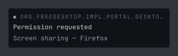

**On screen:** `normal` · name · summary · body

120 characters with no space in them — a reverse-DNS portal id, which is a
real thing a real sender puts in `app_name`. **This shot found a real bug the
first time it was taken:** the name row painted 656.5 px past a 320 px plate,
twice the plate's own width, over whatever window was under it, on a surface
with an empty input region that nothing on the machine can move.

The summary and the body could never do that — both are given `rows.width` and
both wrap. The name row is a `Row`, which takes its width from its children. It
is bound and elided now, and every shot asserts that no plate paints past its
own border.

### 10 — combining marks

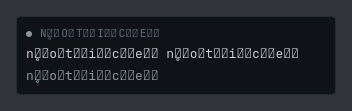

**On screen:** `normal` · name · summary · body

Combining marks stacked far past what a line box expects, in the name and
in the summary. They land as missing glyphs, because JetBrains Mono does not
carry them — that is the font's answer and an honest one; the alternative is a
fallback chain that makes a stranger's string pick the typeface.

What matters here is what does NOT happen: the line height does not blow up, the
plate does not grow, and nothing paints outside it.

### 11 — the tallest this corner can ever be

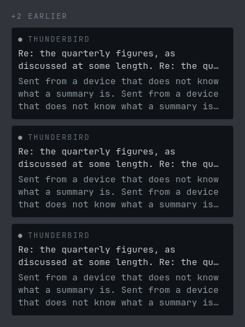

**On screen:** `+2 EARLIER`, then three `normal` plates, every row elided

**This shot is a measurement, not a picture** (PLAN D77). It is the corner at
its own maximum: the cap-many plates, each one with both rows full and elided,
under the `+N EARLIER` line — and nothing a sender can do makes this surface
taller. The reading is the PNG's own **height, 470 px**.

That number is the reason this shell declares no minimum screen height and
warns about no screen, where `jv-hud` does both. The HUD asks the compositor
for a *fixed* 300x826 box, so a screen shorter than 826 crops it, and
`shell/jv-hud/shell.qml` says so in its log. This surface is *derived* —
`stack.implicitHeight + inset·2` — so the question is not whether it fits a
screen but how tall the stack can get, and that is bounded twice: by
`NotifyModel.maxVisible`, and by `Toast` giving the summary two lines and the
body three before it elides. The shortest screen any shell in this repo is ever
loaded on is the 768 px output in `tools/shellload/shells.py`, so the corner at
its worst leaves 298 px of it empty. At today's rhythm the cap could go to five
and still fit; six is where it stops.

`tools/tests/test_notifyshots.py` holds those two numbers together — the
tallest PNG on this sheet against the shortest output that harness declares —
so a theme with a bigger body size, a fourth line of body, or a raised cap goes
red here rather than cropping a corner on somebody's screen.

If it ever does go red, the fix is not a clamp. This column grows *upward* out
of the bottom corner, so the first thing a crop takes is the topmost element:
the `+N EARLIER` line, whose entire job is to say that something is being
hidden.

## How it is checked

Then the sheet is **read back**: every PNG compared against the one committed
at `HEAD`, by `tools/hudsheet.py`. A run whose plates drew something else ends
nonzero, naming the shots that moved and three of the pixels that moved in
them. If the change was deliberate, that is the refresh telling you what you
changed — look at the new PNGs and commit them.

`tools/tests/test_notifyshots.py` is the gate on everything this directory
claims: that the staged strip stacks what `shell.qml` stacks, that the two
stand-ins offer every member the real singletons do, that every shot the driver
takes is committed here and every PNG here is one the driver takes, that each
one is described above, and that the tallest of them still fits the shortest
screen any shell in this repo is loaded on.
