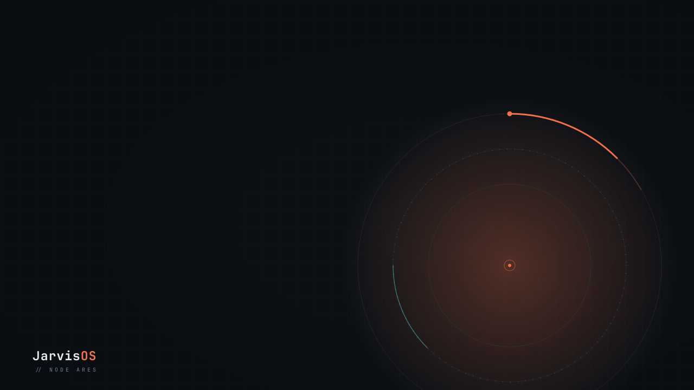
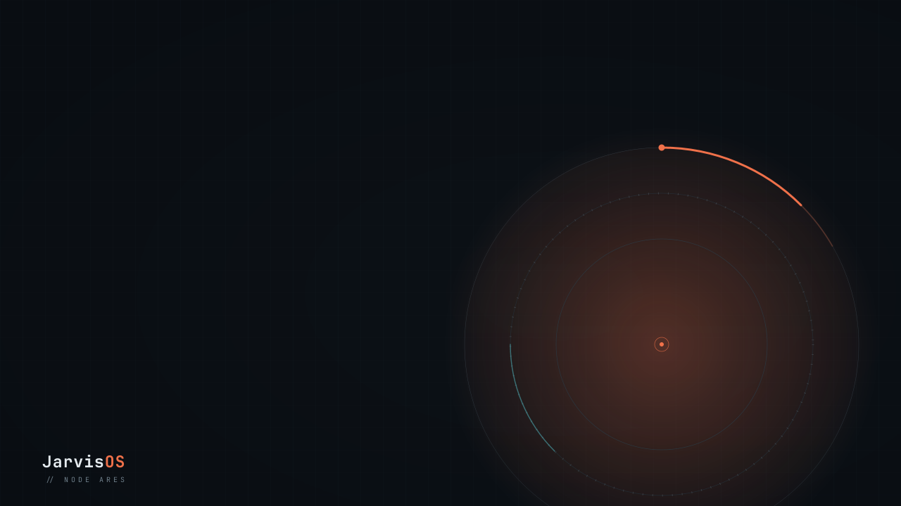
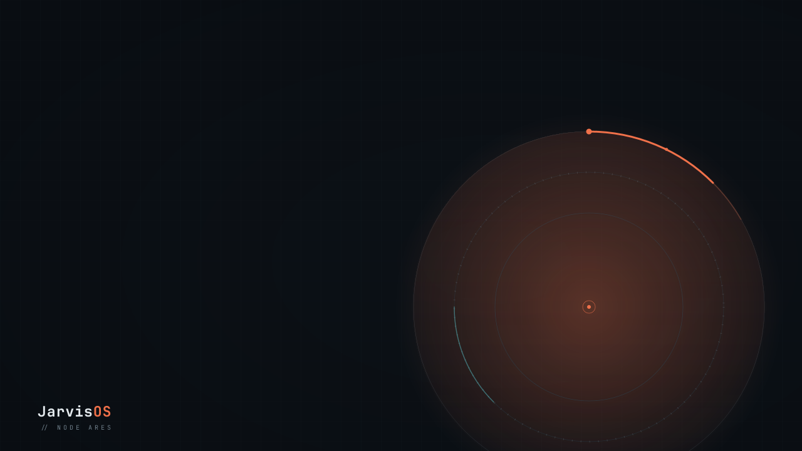
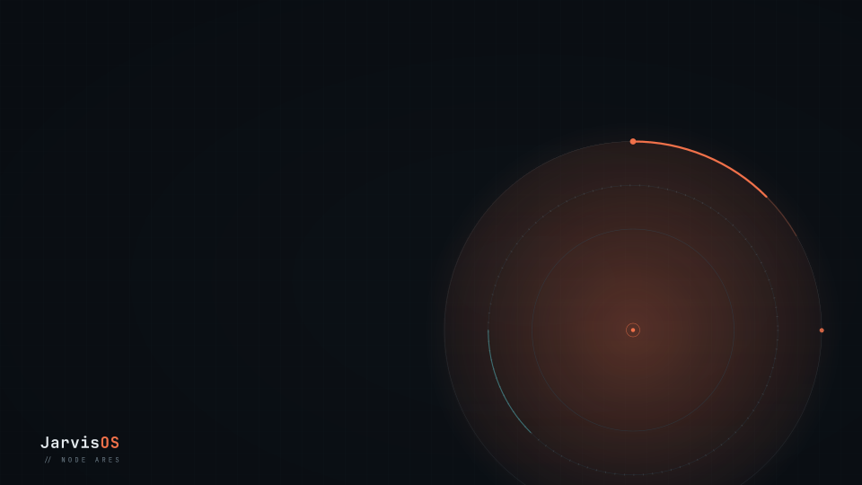
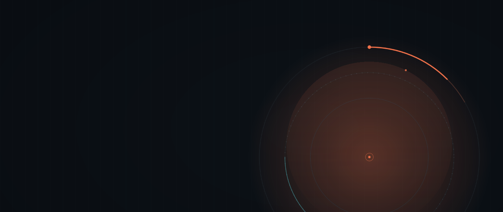
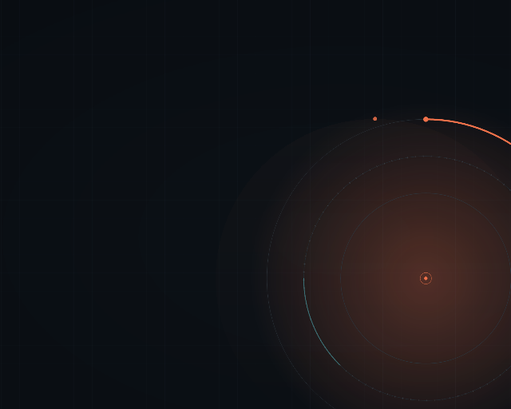

# The animated wallpaper, photographed

Generated by `bash ops/ralph/wallshots.sh`. Re-run it after any change to
`shell/jv-wall` **or** to `pkgs/jarvis-wallpaper`, and commit the diff.

This is the fourth of these sheets, after `docs/hud/`, `docs/notify/` and
`docs/bar/`, and it completes the set: every shell this repo draws now has a
picture of itself (PLAN E8). The shell it photographs is the biggest surface on
the machine — 6.5 megapixels under every window — and until this sheet nothing
here had ever looked at it. `nix build .#jv-wall` runs qmllint over it and
`ops/ralph/shellload.sh` proves it loads; neither can say where the comet is.

## Why this one was the last to get a sheet

It is the only one of the four surfaces whose subject is a **phase** rather than
a state. The HUD reaches "listening" and stays there; the notification corner
reaches "three plates, one critical" and stays there; the bar's teal settles on
a workspace and stops. A wallpaper never arrives anywhere: it breathes on a 14 s
cycle and drifts on a 96 s one, forever, and `wait(14000)` in a test is a
different picture on every machine.

So the shell was given **one number to move**. Both cycles are now bindings on
`phaseMs` — see the paragraph above it in `shell/jv-wall/shell.qml` — and every
shot below is that number, *set*. Nothing on this sheet waits for an animation,
which is why the same pixels come out of it anywhere.

Nothing on screen changed when that happened, and it is arithmetic rather than a
promise: `Easing.InOutSine` is symmetric, so a 0.25 → 1.0 rise followed by a
1.0 → 0.25 fall is one cosine of the whole round trip.
`tools/tests/test_wallshots.py::test_the_breath_is_the_curve_it_replaced` checks
that against a dense sample of the animation pair it replaced, every millisecond
of the 14 s.

## What you are looking at

Each PNG is **one whole output**, laid out at a real monitor's full size and
photographed at **half scale** — 2560x1440 becomes 1280x720. Only the camera is
scaled: every number asserted in the driver is in the real surface's pixels.
Seven full-resolution photographs of a 2560x1440 field would be 6 MB of `docs/`
saying what 600 KB says.

Most of every pixel here belongs to **`pkgs/jarvis-wallpaper`**, which
rasterizes the art from an SVG with resvg at build time, in the palette
`personality/theme.toml` declares. That art is reproducible from this repo and
is not what the sheet is evidence about. What it *is* evidence about is what the
shell puts over the art and where:

- **which render each output resolves.** `jarvisos-<w>x<h>.png` per geometry,
  and `jarvisos.png` when the package does not render one. No picture can tell
  those apart — both are a picture of the same drawing — so it is asserted.
- **where the comet's head is.** `shell.qml` anchors the motion at 73.4% x 68.1%
  of the surface "so it sits inside the rings, not out on the desk". Every shot
  asserts the head is exactly `ir` from that anchor.
- **whether the head is on the output at all.** For about a third of every lap
  it is below the bottom edge.

**The lap.** `phaseMs` runs 0 → 672 000 ms and wraps. 672 s is where the two
cycles agree again (lcm of 14 s and 96 s), so the wrap is a continuous instant in
both rather than a jump in one — and it is the only phase at which both are back
where they started, which is why shot 04 can be a picture of two nameable things
at once.

## What this sheet does not show

Not the compositor. The BACKGROUND layer, the empty input mask,
`ExclusionMode.Ignore`, `WlrKeyboardFocus.None` and the one-surface-per-monitor
`Variants` are `shell.qml`'s, and a human at ares is the only thing that can
confirm them. Not the frame budget either: §06 asks for < 2 ms/frame and 0 fps
when idle, and those are measurements a compositor takes (PLAN E6), not pictures.

---

### 01-still.png — the desktop with motion off

2560x1440. `prefers-reduced-motion`, the declared preference in
`personality/theme.toml`, `JV_REDUCED_MOTION=1` and `JV_MOTION=0` all land here:
the art, and **nothing over it**. Every pixel in this shot belongs to
`pkgs/jarvis-wallpaper`. §06's earned emptiness at its most literal, and the
before-picture for everything below — compare it with 02 to see what a glow at
its *dimmest* is actually worth.

### 02-breath-low.png — the start of a breath

2560x1440, phase 0. The glow at 0.25, its dimmest, and the comet's head at
twelve o'clock — which is exactly where the art **paints** a head. Once every
96 s the moving one passes over the still one and the wallpaper has one comet
again. That is not a coincidence to fix; it is what the anchor being right looks
like on a 16:9 output.

### 03-breath-peak.png — seven seconds later

2560x1440, phase 7 000. The breath at 1.0, the most this surface is ever allowed
to say, and the head 26.25° round. This is the loudest the desktop ever gets on
its own, and the shot to look at if you ever think the wallpaper is competing
with the HUD's ember.

### 04-head-below.png — half a lap, and the comet is gone

2560x1440, phase 336 000 — exactly half the 672 s lap, and the one phase where
both cycles are at a nameable point at once: 24 whole breaths and three and a
half laps. The head is at six o'clock, which on this composition is 562 px below
an instrument centre already at 68% of a 1440 px screen, so it is **off the
bottom edge**. For about a third of every lap the only motion on this desktop is
the breath.

### 05-side.png — ares' other monitor

1920x1080 (DP-1 / DP-2), phase 24 000. The same drawing rasterized for this
panel rather than scaled onto it, which is the whole reason `jarvisos-<w>x<h>.png`
exists (PLAN D10): `swaybg` filling the 1440p art onto a 1080p screen cropped the
instrument and the wordmark by an amount nobody chose. Here the wordmark is
whole. It is also the clearest picture of the comet on the sheet — at 90° the
head is out past the end of the art's painted arc, on the outer ring, where
nothing else is.

### 06-ultrawide.png — a 21:9 output, and a defect

2560x1080, phase 7 000. **This shot found something (PLAN E9).** `resvg`, given
`--width 2560 --height 1080` for a drawing composed at 2560x1440, rasterizes at
1:1 and keeps the top 1080 rows — so the art's instrument stays at y=980 and the
wordmark at y=1330 is simply not in the file. The shell meanwhile anchors its
motion at 68.1% of the *surface*, which is y=735. The two are 245 px apart, and
you can see it: the comet rides a ring that is not the drawn one, and the
wordmark is missing.

Nothing in the harness asserts otherwise — `headRadius` holds the head to the
*shell's* anchor, and no property of this surface can see the art — so this is a
caption on a defect rather than a passing check. ares has no 21:9 panel to find
it on.

### 07-fallback.png — a geometry the package does not render

1280x1024, phase 0. 5:4 is not in `pkgs/jarvis-wallpaper`'s list, so the Image
fails, `onStatusChanged` falls back to the primary art, and
`PreserveAspectCrop` fits it to the screen rather than leaving a black desktop.
That is the one error path this surface has and nobody had ever seen it fire.

It is also the same defect as 06 from the other direction: the crop scales and
centres the art, the anchor is a percentage of the surface, and at phase 0 the
moving head lands *beside* the painted one instead of on it.
